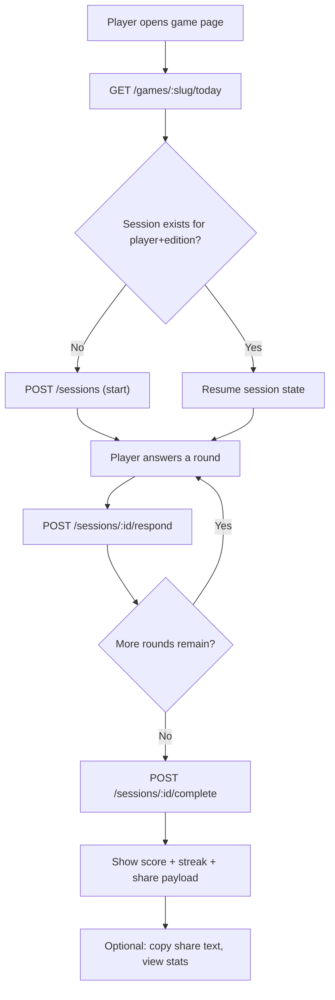
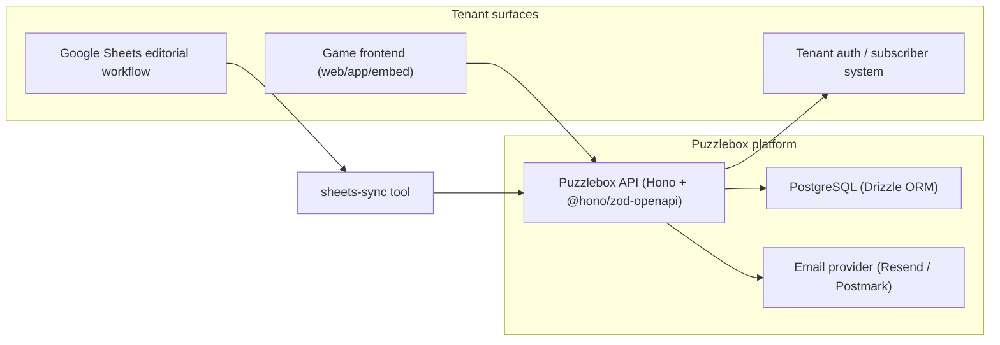

# Puzzlebox PRD

> Status note (March 13, 2026): this document is historical product context and includes planned features that are not all implemented in the OSS baseline.  
> Source of truth for current behavior is `README.md`, `AGENTS.md`, and `apps/docs/docs/`.

**The open-source middleware for building daily-play games for newsrooms.**

Version: 1.0 (Production-ready)
Last updated: February 14, 2026
Status: Ready for implementation

---

## Executive Summary

Puzzlebox is an open-source, API-first backend framework for building and operating daily-play games. It provides the infrastructure layer that every daily game needs — daily scheduling, server-side answer validation, player accounts, streaks, scoring, analytics, shareable results — so that publishers can focus on designing great games instead of rebuilding backend plumbing.

The thesis: most daily games share identical backend needs. The game mechanics differ (word guessing vs. trivia vs. sorting), but the platform needs (one puzzle per day, track who played, calculate streaks, generate share cards, show editors how it's performing) are the same. Puzzlebox extracts that platform layer into a reusable, open-source framework.

This PRD is designed for two audiences: human stakeholders evaluating the product, and AI coding agents building the implementation. Every data model, API endpoint, and architectural decision is specified concretely — no ambiguous placeholders.

---

## 1. Why This Exists

### The market signal

Daily-play games have become a core revenue and retention strategy for newsrooms:

- NYT Games achieved over 8 billion plays in 2023, with tens of millions of weekly players. The Games-only subscription surpassed 1 million subscribers at $40/year. NYT has found that subscribers who engage with both news and games retain at higher rates than those who use only one product.
- Hearst acquired Puzzmo in December 2023 and rolled it out across 50+ Hearst brands, with additional distribution to Vox Media's Polygon, Digg, theSkimm, and 120+ Postmedia brands in Canada.
- LinkedIn launched daily games in May 2024. Apple News introduced Quartiles for Apple News+ subscribers. The Washington Post expanded internal game efforts.
- Arkadium licenses 300+ white-label HTML5 games to publishers via an ad-supported model.
- PuzzleMe (Amuse Labs) offers a SaaS embed platform for crosswords and puzzles with per-gameplay pricing, used by Scientific American and The New Yorker.

### The gap

Every existing solution is closed-source, proprietary, or narrowly scoped:

| Alternative | Model | Strengths | Constraints | Puzzlebox advantage |
|---|---|---|---|---|
| Puzzmo (Hearst) | Publisher-owned platform | Proven rollout across many brands; unified points and community | Not open-source; not self-hostable; opaque pricing | Open-source + self-host/hosted choice + API-first primitives |
| Arkadium | Licensed library / white-label + ads | Large catalog; fast to embed | Less control over editorial voice and custom mechanics; ad model | Custom editorial games and full data ownership |
| PuzzleMe (Amuse Labs) | SaaS puzzle builder + embeds | Broad puzzle types; published pricing; streaks and analytics in paid tiers | SaaS dependency; pricing/quotas; limited custom game support | Extensible primitives and OSS flexibility |
| Build in-house | Fully custom | Perfect fit to brand and workflows | High engineering cost; repeated reinvention; hard to scale across games | Reuse layer that proves cost/time reduction |

There is zero open-source infrastructure for daily-play games at the platform level. What exists is dozens of standalone Wordle clones — individual games with no shared scheduling, streaks, scores, player identity, or analytics layer.

### The opportunity

Puzzlebox fills the missing middleware layer: a single API that any game frontend can plug into to get daily scheduling, server-side answer validation, player accounts, streaks, scores, analytics, and shareable results out of the box. It does not build games. It provides the infrastructure that makes games work as a daily engagement product.

---

## 2. Business Model

### Open-source core

The Puzzlebox API, database schema, SDKs, documentation, and reference implementations are fully open-source (MIT license). Any newsroom with an engineering team can clone the repo, run `docker compose up`, and have a working instance.

### Paid services

1. **Hosted Puzzlebox**: We run the infrastructure. The newsroom gets an API endpoint, a dashboard, and an SLA. No deployment, no maintenance, no DevOps.
2. **Custom game development**: We design and build production-ready game frontends on top of the Puzzlebox API. This is the primary revenue target.
3. **AI-powered content generation** (future): After a game accumulates 4+ months of content, AI generates new content matching vibe and difficulty with human editorial approval.

The open-source project is the top of the funnel. It builds trust, demonstrates capability, and attracts clients who want to pay for the hard part.

---

## 3. Users and Use Cases

### Target personas

| Persona | Job to be done | Success looks like | Key constraints |
|---|---|---|---|
| Games / audience editor | Publish a daily game reliably and turn it into editorial programming | Consistent on-time editions; high completion and share rates; reusable content pipeline | Limited engineering support; needs simple workflows and preview/QA |
| Newsroom engineer | Embed and customize games in the site/app stack and identity ecosystem | Low integration overhead; predictable APIs; secure tenancy | Must fit existing auth/SSO, analytics, and privacy policies |
| Product lead / GM | Prove retention/engagement impact and justify investment | Clear KPIs; correlation analyses when possible | Subscriber data may be siloed; limited appetite for major rebuilds |
| Player / reader | Get a fun daily challenge and share results | Fast load; clear rules; streak continuity; delightful reveals | Accessibility and mobile expectations; no login wall for first play |

### Priority use cases

1. **Daily game publishing**: An editor publishes today's game edition (with multiple rounds) and it appears on the site/app at a predictable local time.
2. **Daily play loop**: A player starts today's edition, answers each round, receives correct/incorrect reveals with explanations, gets a final score and streak update.
3. **Low-friction sharing**: A player shares a results summary (emoji grid) that drives reacquisition.
4. **Analytics for iteration**: Editors and product leads see which rounds were hardest, completion funnels, and per-edition session counts.
5. **Tenant-specific identity**: Deployments support multiple identity strategies (magic link, OAuth, external auth, anonymous) without redesigning core gameplay.

### Core gameplay flow



---

## 4. Current Clients

### That's What They Say (TWTS)

**Client**: Michigan Public (NPR affiliate) / University of Michigan
**Show**: A weekly 5-minute segment airing since 2013 exploring how and why the English language changes — word origins, shifting meanings, regional variation, slang, and the stories hiding inside everyday expressions.

**Hosts**:
- **Anne Curzan**: Geneva Smitherman Collegiate Professor of English, Linguistics, and Education at the University of Michigan. Yale-trained linguist. TED talk with 2M+ views. Author of *Says Who? A Kinder, Funner Usage Guide for Everyone Who Cares About Words* (2024). The delighted professor who always has three more layers to dig into.
- **Rebecca Hector**: All Things Considered host at Michigan Public. The sharp, relatable reactor who tests every claim against her own gut instinct. The listener's proxy.

**What they want**: A daily game suite (à la NYT Games), a user survey that generates podcast content, and a live show voting component.

**Status**: Four game concepts designed, episode transcript analysis complete (20 episodes), content patterns identified. Ready for development.

#### TWTS Game Suite

**Design philosophy**: When you get something wrong, the reveal should feel like a delightful surprise, not a correction. The tone is "huh!" not "wrong." Every answer teaches you something. Every result is shareable. Every game sends you back to the podcast.

**Game 1: Who Says?**
Mode: `pick_one`
Match words/phrases to which host (Anne or Rebecca) favors them. 5 rounds per day. Riffs on Anne's book title *Says Who?*.

Content sourced from transcript analysis — the hosts have genuinely distinct linguistic fingerprints. Rebecca uses "up to snuff" but not "up to scratch." Anne uses Reynolds Wrap generically; Rebecca doesn't. Rebecca says "oddly enough," Anne can do "funnily enough."

Example round:
> **Who says "movers and shakers"?**
> A) Anne  B) Rebecca
> ✅ Anne — She uses this phrase constantly. The expression dates to Arthur O'Shaughnessy's 1874 poem.

Primitives exercised: server-side validation, per-round reveal payload (fun fact + episode link), scoring, per-round accuracy analytics, emoji share grid.

**Game 2: Name that Locale** (title TBD)
Mode: `pick_one`
Show a word or phrase with regional variation, guess which region it comes from. 5 rounds per day.

Example round:
> **Where do people call it a "bubbler" instead of a drinking fountain?**
> A) Wisconsin  B) Georgia  C) Maine  D) Oregon
> ✅ Wisconsin — The term comes from Kohler Company's early drinking fountain brand.

Primitives exercised: 2–4 option handling, rich metadata in reveal, "most common wrong answer" analytics.

**Game 3: Timelines**
Mode: `ordered_sequence`
Sort words into chronological order by when they first appeared or shifted meaning. Multiple groups per edition.

Example round:
> **Put these in order of first recorded use:**
> lickety-split (1818) → smack dab (1839) → pep (1908) → shout out (1980s)

Primitives exercised: ordered validation with partial credit, per-position accuracy analytics, complex share payloads showing correctness by position.

**Game 4: What Do YOU Say?**
Mode: `survey`
A daily poll asking users what they call common things. No correct answer — the value is in aggregate results and the content pipeline back to the podcast.

Example round:
> **What do you call the metal sheet you cover leftovers with?**
> A) Tin foil  B) Aluminum foil  C) Reynolds Wrap  D) Foil

After answering, the player sees: "You said 'tin foil' — 38% of players agree. 45% say 'aluminum foil.'" This data feeds back to Anne and Rebecca as show content.

Primitives exercised: survey response aggregation, distribution display, analytics export, share payload centered on "my choice vs. the crowd."

**Live show component** (future): Real-time audience voting during live events. Reuses the survey mode infrastructure.

### Baltimore Banner

**Client**: Baltimore Banner — a well-funded digital-first newsroom launched in 2022.
**Status**: Exploratory. Likely candidates include local history trivia, Baltimore-themed word games, and community-oriented survey games.
**Significance**: First proof of the commercial model. Validates the open-source-to-enterprise pipeline.

---

## 5. Technical Architecture

### Architecture overview



### Tech stack

| Layer | Choice | Rationale |
|---|---|---|
| Language | TypeScript | One language across stack. Newsroom and game devs know it. Agents work well with it. |
| API framework | Hono | Lightweight, fast, runtime-agnostic (Node, Bun, Cloudflare Workers). ~5,600 RPS with real DB queries in benchmarks — 3x Express, 30% faster than Fastify, 52% less memory. |
| OpenAPI | @hono/zod-openapi | Official Hono middleware. Routes defined declaratively via `createRoute()`, auto-validated, auto-documented. OpenAPI 3.1 spec generated from Zod schemas. |
| API docs | @scalar/hono-api-reference | Interactive API docs served at `/reference`. Handles OpenAPI 3.1 natively. |
| Database | PostgreSQL | Relational model fits perfectly. Strong aggregation for analytics. Well-understood for self-hosting. |
| ORM | Drizzle | Type-safe, lightweight, no magic. Clean SQL generation. `drizzle-orm/zod` + `createSchemaFactory` bridges Drizzle schemas → Zod → OpenAPI seamlessly. |
| Validation | Zod (via @hono/zod-openapi) | All request/response shapes defined as Zod schemas. Auto-generates OpenAPI spec. **Always import `z` from `@hono/zod-openapi`, never from `zod` directly.** |
| Auth | Custom JWT (HS256) | Magic link, OAuth, external webhook, anonymous — simple enough for in-house. No third-party auth service needed. |
| Email | Resend or Postmark | For hosted tier magic links. Self-hosted deployments configure their own SMTP. |
| Rate limiting | hono-rate-limiter | Sliding window counter. In-memory for single-instance deployments. |
| Frontend hosting | Netlify | Game frontends (React SPAs). CDN-cached, deploy-on-push, branch previews for QA. |
| API + DB hosting | Railway | Persistent Node process + managed Postgres in one dashboard. Deploy-on-push from GitHub. Avoids serverless pitfalls (connection pooling, no persistent scheduler, no in-memory rate limiting). |
| Local dev | Docker Compose | One `docker-compose.yml` spins up API + Postgres locally. Also serves as the self-hosted OSS deployment path. |
| Testing | Vitest | Fast, TypeScript-native, Hono-compatible. |

### Key architecture decisions

**Tenant isolation: App-layer filtering (v1), RLS defense-in-depth (v2)**

Every tenant-scoped table has a `tenant_id UUID NOT NULL` column, indexed as the leading column in composite indexes. Hono middleware extracts `tenant_id` from the verified JWT and attaches it to request context. A Drizzle helper function enforces `WHERE tenant_id = ?` on all tenant-scoped queries — this is the single enforcement point.

Postgres Row-Level Security (RLS) is deferred to v2 because Drizzle-kit's current RLS migration tooling is immature — it can silently delete RLS policies or create empty policies that lock the system. When added, RLS will use raw SQL migrations (not Drizzle-kit), with a non-superuser `app_user` role and `SET LOCAL app.tenant_id` in transaction-wrapped middleware.

Integration tests verify cross-tenant isolation by attempting queries with mismatched tenant IDs.

**Authentication: Single 24-hour JWT, no refresh tokens (v1)**

A daily game API has the ideal pattern for moderate-lived JWTs: players return roughly once per day, the data at stake is game scores (not financial), and re-authentication cost is low. Refresh token rotation complexity (server-side storage, token family tracking, reuse detection) is not justified until the platform handles payments or verified PII.

JWT claim structure:
```json
{
  "sub": "player_uuid",
  "iss": "https://api.puzzlebox.dev",
  "aud": "https://api.puzzlebox.dev",
  "iat": 1707900000,
  "exp": 1707986400,
  "jti": "unique_token_id",
  "tid": "tenant_slug",
  "scp": "play"
}
```

Signed with HS256 using a 256-bit+ cryptographically random secret. Algorithm hardcoded on verification (never trust the JWT header's `alg` field per OWASP/RFC 8725). No PII in the token payload. `scp` is `play` for players, `admin` for editors. Token storage: `HttpOnly` + `Secure` + `SameSite=Lax` cookies for web; Keychain/Keystore for native.

Add refresh tokens when the platform handles real money or requires immediate session revocation.

**Streaks: Server-side, player timezone, with grace period and freeze**

Edition dates resolve based on the tenant's editorial timezone. Streaks calculate based on the player's stored IANA timezone. A configurable grace period (default: 3 hours) allows late-night play to count for the previous day. Two pre-equipped streak freezes auto-consume at end-of-day if the player hasn't completed the edition. Streak freezes preserve the count without incrementing it.

All timestamps stored as UTC. Never calculate "next day" as `timestamp + 86400 seconds` — use timezone-aware calendar arithmetic via `date-fns-tz`. DST transitions create 23-hour and 25-hour days that break naive math (documented production bugs in Lost Ark, Gran Turismo 7, and Star Wars: Galaxy of Heroes).

**OpenAPI generation pipeline**

Drizzle table → `createSchemaFactory({ zodInstance: z })` → Zod schema with `.openapi('Name')` → `createRoute()` definition → auto-generated OpenAPI 3.1 spec at `/doc` → Scalar interactive docs at `/reference`.

The `createSchemaFactory` bridge is critical: Drizzle's built-in `createSelectSchema` uses standard `z` which lacks `.openapi()`. The one-liner fix:
```typescript
import { createSchemaFactory } from 'drizzle-orm/zod';
import { z } from '@hono/zod-openapi';
const { createSelectSchema, createInsertSchema } = createSchemaFactory({ zodInstance: z });
```

### Game modes (v1)

Three fundamental interaction patterns. Every game declares one mode, which determines validation logic, scoring, and analytics.

**`pick_one`**: A prompt with multiple options, one correct answer. Server stores correct answer, validates on submission, returns correctness + correct answer + metadata. Scoring: 1 point per correct (configurable). Analytics: per-round accuracy. Covers: Who Says?, Name that Locale, trivia.

**`ordered_sequence`**: A set of items the player arranges in correct order. Server stores correct ordering, compares positions. Scoring: 1 point per correctly-placed item (partial credit). Analytics: per-position accuracy, perfect-order rate. Covers: Timelines, chronological sorting.

**`survey`**: A prompt with options, no correct answer. After responding, player sees aggregate distribution. Scoring: participation-based (configurable: 1 point or none). Analytics: full response distribution, exportable. Covers: What Do YOU Say?, audience polls.

Future modes (not v1): `match_pairs`, `text_input` (Wordle-style with fuzzy matching), `grouping` (Connections-style).

### Data model

```
Tenant
├── id (uuid, PK)
├── name (string) — "Michigan Public", "Baltimore Banner"
├── slug (string, unique) — "michigan-public"
├── timezone (string, IANA) — "America/Detroit"
├── auth_config (jsonb) — enabled auth methods and settings
├── created_at (timestamptz)
├── updated_at (timestamptz)
│
├── ApiKey[]
│   ├── id (uuid, PK)
│   ├── tenant_id (fk)
│   ├── key_hash (string) — bcrypt hash, never store plaintext
│   ├── label (string) — "production", "staging"
│   ├── scopes (text[]) — ["admin", "editor"]
│   ├── expires_at (timestamptz, nullable)
│   ├── created_at (timestamptz)
│   └── last_used_at (timestamptz, nullable)
│
├── Game[]
│   ├── id (uuid, PK)
│   ├── tenant_id (fk)
│   ├── name (string) — "Who Says?"
│   ├── slug (string, unique per tenant) — "who-says"
│   ├── mode (enum) — "pick_one" | "ordered_sequence" | "survey"
│   ├── config (jsonb)
│   │   ├── rounds_per_edition (int) — default 5
│   │   ├── partial_credit (bool) — for ordered_sequence, default true
│   │   ├── share_emoji_correct (string) — "🟩"
│   │   ├── share_emoji_incorrect (string) — "🟥"
│   │   ├── share_emoji_game (string) — "🎙️"
│   │   ├── share_url_template (string) — "https://play.twts.org/{slug}"
│   │   └── allow_anonymous (bool) — default true
│   ├── active (bool) — default true
│   ├── created_at (timestamptz)
│   ├── updated_at (timestamptz)
│   │
│   └── Edition[]
│       ├── id (uuid, PK)
│       ├── game_id (fk)
│       ├── tenant_id (fk) — denormalized for query efficiency
│       ├── edition_date (date) — "2026-02-14", in tenant timezone
│       ├── status (enum) — "draft" | "scheduled" | "active" | "archived"
│       ├── publish_at (timestamptz, nullable) — when to auto-activate
│       ├── metadata (jsonb, nullable) — theme, episode link, notes
│       ├── created_at (timestamptz)
│       ├── updated_at (timestamptz)
│       ├── UNIQUE(game_id, edition_date)
│       │
│       └── Round[]
│           ├── id (uuid, PK)
│           ├── edition_id (fk)
│           ├── tenant_id (fk) — denormalized
│           ├── position (int) — order within edition (1, 2, 3...)
│           ├── prompt (text) — the question or instruction
│           ├── options (jsonb) — array of option objects
│           │   └── [{ "key": "a", "label": "Anne" }, { "key": "b", "label": "Rebecca" }]
│           ├── correct_answer (jsonb, nullable)
│           │   ├── pick_one: { "key": "a" }
│           │   ├── ordered_sequence: { "order": ["c", "a", "d", "b"] }
│           │   └── survey: null
│           ├── metadata (jsonb, nullable) — fun fact, explanation, source, episode URL
│           ├── created_at (timestamptz)
│           └── UNIQUE(edition_id, position)

Player
├── id (uuid, PK)
├── tenant_id (fk)
├── auth_method (enum) — "magic_link" | "oauth" | "external" | "anonymous"
├── email (string, nullable, unique per tenant when not null)
├── external_id (string, nullable) — publisher's subscriber ID
├── display_name (string, nullable)
├── anonymous_token (string, nullable) — for anonymous sessions
├── timezone (string, IANA, nullable) — "America/Chicago", for streak calc
├── created_at (timestamptz)
├── updated_at (timestamptz)
│
├── Session[]
│   ├── id (uuid, PK)
│   ├── player_id (fk)
│   ├── edition_id (fk)
│   ├── tenant_id (fk) — denormalized
│   ├── started_at (timestamptz)
│   ├── completed_at (timestamptz, nullable)
│   ├── score (int, nullable) — set on completion
│   ├── max_score (int, nullable) — set on completion
│   ├── share_data (jsonb, nullable) — generated on completion
│   ├── UNIQUE(player_id, edition_id) — one attempt per player per edition
│   │
│   └── Response[]
│       ├── id (uuid, PK)
│       ├── session_id (fk)
│       ├── round_id (fk)
│       ├── tenant_id (fk) — denormalized
│       ├── answer (jsonb) — what the player submitted
│       │   ├── pick_one: { "key": "a" }
│       │   ├── ordered_sequence: { "order": ["c", "a", "d", "b"] }
│       │   └── survey: { "key": "b" }
│       ├── is_correct (bool, nullable) — null for survey
│       ├── score (int) — points earned for this round
│       ├── responded_at (timestamptz)
│       └── UNIQUE(session_id, round_id) — one response per round

PlayerStreak
├── player_id (fk, PK component)
├── game_id (fk, PK component)
├── tenant_id (fk) — denormalized
├── current_streak (int) — default 0
├── longest_streak (int) — default 0
├── last_played_date (date) — in player's timezone
├── freezes_remaining (int) — default 2
├── updated_at (timestamptz)
├── UNIQUE(player_id, game_id)

StreakFreezeEvent
├── id (uuid, PK)
├── player_id (fk)
├── game_id (fk)
├── tenant_id (fk)
├── event_type (enum) — "auto_consumed" | "manual_consumed" | "granted" | "purchased"
├── freeze_date (date)
├── reason (text, nullable)
├── created_at (timestamptz)
```

### Indexing strategy

All composite indexes lead with `tenant_id` for query scoping:
- `editions(tenant_id, game_id, edition_date)` — the "today" lookup
- `sessions(tenant_id, player_id, edition_id)` — the "have I played?" check
- `responses(tenant_id, session_id, round_id)` — idempotent response check
- `player_streaks(tenant_id, player_id, game_id)` — streak lookup
- `players(tenant_id, email)` — login lookup (partial unique index where email is not null)

---

## 6. API Specification

Base URL: `/api/v1`
Tenant resolution: `X-Tenant` header containing tenant slug, or subdomain-based routing.
OpenAPI 3.1 spec: `/doc`
Interactive docs: `/reference`

### Auth endpoints (public)

**`POST /auth/magic-link`** — Send a magic link email.
```
Request:  { "email": "player@example.com" }
Response: { "message": "Check your email", "expires_in": 600 }
```

**`POST /auth/verify`** — Verify a magic link token. Returns JWT.
```
Request:  { "token": "abc123def456" }
Response: {
  "player_id": "uuid",
  "jwt": "eyJ...",
  "expires_at": "2026-02-15T12:00:00Z"
}
```

**`POST /auth/anonymous`** — Create anonymous player session.
```
Request:  { "device_fingerprint": "optional-device-id" }
Response: {
  "player_id": "uuid",
  "jwt": "eyJ...",
  "anonymous": true,
  "expires_at": "2026-02-15T12:00:00Z"
}
```

**`POST /auth/claim`** — Merge anonymous account into authenticated account.
```
Request:  { "anonymous_jwt": "eyJ...", "authenticated_jwt": "eyJ..." }
Response: { "player_id": "uuid", "sessions_merged": 12 }
```

**`POST /auth/external`** — BYO auth (publisher validates, Puzzlebox issues JWT).
```
Request:  { "external_token": "publisher-jwt-or-session-id" }
Response: { "player_id": "uuid", "jwt": "eyJ...", "expires_at": "..." }
```
Server calls the tenant's configured `auth_webhook_url` to validate the external token. If valid, creates or matches a player record and issues a Puzzlebox JWT.

**`GET /auth/oauth/:provider/start`** — Redirect to OAuth provider.
**`GET /auth/oauth/:provider/callback`** — Handle OAuth callback, issue JWT.

### Editor/admin endpoints (API key auth)

**`POST /games`** — Create a game.
```
Request: {
  "name": "Who Says?",
  "slug": "who-says",
  "mode": "pick_one",
  "config": {
    "rounds_per_edition": 5,
    "share_emoji_correct": "🟩",
    "share_emoji_incorrect": "🟥",
    "share_emoji_game": "🎙️",
    "share_url_template": "https://play.twts.org/who-says",
    "allow_anonymous": true
  }
}
Response: { "id": "uuid", "slug": "who-says", "mode": "pick_one", ... }
```

**`GET /games`** — List all games for the tenant.
**`GET /games/:slug`** — Get a game by slug.
**`PATCH /games/:slug`** — Update game config.
**`DELETE /games/:slug`** — Soft-delete a game (sets `active: false`).

**`POST /games/:slug/editions`** — Create an edition with all rounds in a single payload. This is the main content ingestion endpoint.
```
Request: {
  "edition_date": "2026-02-14",
  "status": "scheduled",
  "publish_at": "2026-02-14T00:00:00-05:00",
  "metadata": { "episode_url": "https://michiganpublic.org/..." },
  "rounds": [
    {
      "position": 1,
      "prompt": "Who says 'movers and shakers'?",
      "options": [
        { "key": "a", "label": "Anne" },
        { "key": "b", "label": "Rebecca" }
      ],
      "correct_answer": { "key": "a" },
      "metadata": {
        "fun_fact": "She uses this phrase constantly. The expression dates to an 1874 poem.",
        "episode": "S12E04"
      }
    },
    { "position": 2, ... },
    { "position": 3, ... },
    { "position": 4, ... },
    { "position": 5, ... }
  ]
}
Response: { "id": "uuid", "edition_date": "2026-02-14", "status": "scheduled", "round_count": 5 }
```

Validation rules: reject if `rounds` count doesn't match `config.rounds_per_edition`. Reject if `correct_answer` is null for non-survey modes. Reject if `correct_answer` is present for survey mode. Reject if a duplicate `edition_date` already exists for this game.

**`GET /games/:slug/editions`** — List editions for a game (paginated, filterable by status/date).
**`GET /editions/:id`** — Get an edition with rounds (includes `correct_answer` for editors).
**`PATCH /editions/:id`** — Update edition status, metadata, or schedule.
**`POST /editions/:id/publish`** — Transition status from `draft`/`scheduled` to `active`.
**`POST /editions/:id/archive`** — Transition status to `archived`.

**`GET /editions/:id/rounds`** — List rounds for an edition.
**`PATCH /rounds/:id`** — Update a round (only when edition is `draft`).
**`DELETE /rounds/:id`** — Delete a round (only when edition is `draft`).

**`GET /players`** — List players (paginated).
**`GET /players/:id`** — Get a player.
**`DELETE /players/:id`** — Delete a player and all associated data (GDPR/CCPA compliance).

### Player endpoints (JWT auth)

**`GET /games`** — List active games for this tenant.
```
Response: {
  "games": [
    { "slug": "who-says", "name": "Who Says?", "mode": "pick_one", "has_today": true },
    ...
  ]
}
```

**`GET /games/:slug/today`** — Get today's edition with rounds (without answers). This is the primary endpoint game frontends call on load.
```
Response: {
  "edition_id": "uuid",
  "edition_date": "2026-02-14",
  "game": { "name": "Who Says?", "slug": "who-says", "mode": "pick_one" },
  "rounds": [
    {
      "id": "uuid",
      "position": 1,
      "prompt": "Who says 'movers and shakers'?",
      "options": [
        { "key": "a", "label": "Anne" },
        { "key": "b", "label": "Rebecca" }
      ]
    },
    ...
  ],
  "existing_session": null
}
```
If the player already has a session, `existing_session` returns their progress (responses so far, score, completed status). Handles page refreshes, device switching, and resume.

**`POST /sessions`** — Start a session for an edition. Returns 409 if session exists (with the existing session in the response body).
```
Request:  { "edition_id": "uuid" }
Response: { "session_id": "uuid", "started_at": "2026-02-14T08:23:00Z" }
```

**`GET /sessions/:id`** — Get current session state and responses so far.

**`POST /sessions/:id/respond`** — Submit an answer to a round. Server validates immediately.
```
Request: { "round_id": "uuid", "answer": { "key": "a" } }

Response (pick_one): {
  "is_correct": true,
  "correct_answer": { "key": "a" },
  "score": 1,
  "metadata": {
    "fun_fact": "She uses this phrase constantly. The expression dates to an 1874 poem."
  }
}

Response (ordered_sequence): {
  "is_correct": false,
  "correct_answer": { "order": ["c", "a", "d", "b"] },
  "score": 2,
  "positions_correct": [false, true, false, true],
  "metadata": { ... }
}

Response (survey): {
  "is_correct": null,
  "distribution": {
    "a": { "label": "Tin foil", "count": 488, "percentage": 0.38 },
    "b": { "label": "Aluminum foil", "count": 578, "percentage": 0.45 },
    "c": { "label": "Reynolds Wrap", "count": 134, "percentage": 0.10 },
    "d": { "label": "Foil", "count": 89, "percentage": 0.07 }
  },
  "total_responses": 1289,
  "your_answer": "a"
}
```

**`POST /sessions/:id/complete`** — Finalize session. Calculates total score, updates streak, generates share data.
```
Response: {
  "session_id": "uuid",
  "score": 4,
  "max_score": 5,
  "duration_seconds": 87,
  "streak": {
    "current": 12,
    "longest": 23,
    "is_new_record": false,
    "freezes_remaining": 2
  },
  "share_data": {
    "game_name": "Who Says?",
    "game_emoji": "🎙️",
    "edition_date": "2026-02-14",
    "score": 4,
    "max_score": 5,
    "streak": 12,
    "per_round": [true, true, false, true, true],
    "share_text": "Who Says? 🎙️ 4/5\n🟩🟩🟥🟩🟩\n🔥 12-day streak\nhttps://play.twts.org/who-says"
  }
}
```

**`GET /me/stats`** — Player's stats across all games.
```
Response: {
  "player_id": "uuid",
  "games": [
    {
      "game_slug": "who-says",
      "total_sessions": 45,
      "current_streak": 12,
      "longest_streak": 23,
      "average_score_pct": 0.78,
      "last_played": "2026-02-14",
      "freezes_remaining": 2
    },
    ...
  ]
}
```

**`PATCH /me`** — Update player profile (timezone, display_name).
```
Request: { "timezone": "America/Chicago", "display_name": "wordnerd42" }
```

### Analytics endpoints (API key auth)

**`GET /analytics/overview`** — Tenant-level analytics.
```
Response: {
  "daily_active_players": 4521,
  "total_sessions_today": 8934,
  "games": [
    { "slug": "who-says", "dap": 2341, "completion_rate": 0.88 },
    { "slug": "timelines", "dap": 1456, "completion_rate": 0.72 },
    ...
  ]
}
```

**`GET /games/:slug/analytics`** — Game-level analytics.
```
Response: {
  "game_slug": "who-says",
  "daily_active_players": 2341,
  "completion_rate": 0.88,
  "average_score_pct": 0.74,
  "share_rate": 0.31,
  "return_rate": 0.67,
  "streak_distribution": {
    "1": 890, "2-3": 534, "4-7": 412, "8-14": 267, "15-30": 156, "30+": 82
  },
  "editions_count": 47,
  "total_sessions_all_time": 54230
}
```

**`GET /editions/:id/analytics`** — Edition-level analytics.
```
Response: {
  "edition_id": "uuid",
  "total_sessions": 1243,
  "completed_sessions": 1089,
  "completion_rate": 0.876,
  "average_score": 3.7,
  "max_possible_score": 5,
  "average_duration_seconds": 94,
  "per_round": [
    { "round_id": "uuid", "position": 1, "accuracy": 0.82, "most_common_wrong": "b" },
    { "round_id": "uuid", "position": 2, "accuracy": 0.91, "most_common_wrong": null },
    ...
  ],
  "score_distribution": { "0": 12, "1": 34, "2": 89, "3": 267, "4": 398, "5": 289 },
  "completion_funnel": { "started": 1243, "round_1": 1230, "round_2": 1198, "round_3": 1145, "round_4": 1102, "round_5": 1089 },
  "survey_distributions": null
}
```

For survey-mode editions, `survey_distributions` contains per-round response distributions with counts and percentages, exportable as CSV.

---

## 7. Integrity and Anti-Cheating

**Answers never reach the client.** The `/games/:slug/today` response excludes `correct_answer` fields. The correct answer is only revealed in the response to `/sessions/:id/respond`, after the player has committed their answer.

**One session per edition per player.** Enforced by `UNIQUE(player_id, edition_id)`. Starting a second session returns the existing one.

**Rate limiting on submissions.** The `/sessions/:id/respond` endpoint is rate-limited to 30 requests/minute per player. Prevents scripted brute-forcing.

**Idempotent responses.** The `UNIQUE(session_id, round_id)` constraint prevents re-answering a round. Duplicate submissions return the original response.

### Rate limit tiers

| Endpoint category | Limit | Key |
|---|---|---|
| General authenticated API | 100 req/min | Player ID |
| Game submissions (respond) | 30 req/min | Player ID |
| Read-heavy (stats, today) | 200 req/min | Player ID |
| Login / signup | 10 req/15 min | IP address |
| Global safety net | 300 req/min | IP address |

Headers: `RateLimit-Limit`, `RateLimit-Remaining`, `RateLimit-Reset` (draft-6 format). `Retry-After` on all 429 responses.

---

## 8. Content Ingestion

### API-first

The primary ingestion method is `POST /games/:slug/editions`, accepting a full edition with all rounds in a single payload. Editors or automated systems push content directly.

### Google Sheets sync (reference tool)

For editorial teams comfortable with spreadsheets, the repo includes a `/tools/sheets-sync` utility — a lightweight script that reads rows from a Google Sheet and POSTs them to the Puzzlebox API.

Sheet schemas per game mode:

**pick_one** (Who Says?, Name that Locale, trivia):

| edition_date | position | prompt | option_a | option_b | option_c | option_d | correct | fun_fact | episode_ref |
|---|---|---|---|---|---|---|---|---|---|
| 2026-02-14 | 1 | Who says 'movers and shakers'? | Anne | Rebecca | | | a | She uses this phrase constantly... | S12E04 |

**ordered_sequence** (Timelines):

| edition_date | position | prompt | item_1_label | item_1_sort | item_2_label | item_2_sort | item_3_label | item_3_sort | item_4_label | item_4_sort |
|---|---|---|---|---|---|---|---|---|---|---|
| 2026-02-14 | 1 | Order by first recorded use | lickety-split | 1818 | smack dab | 1839 | pep | 1908 | shout out | 1983 |

**survey** (What Do YOU Say?):

| edition_date | position | prompt | option_a | option_b | option_c | option_d |
|---|---|---|---|---|---|---|
| 2026-02-14 | 1 | What do you call the metal sheet you cover leftovers with? | Tin foil | Aluminum foil | Reynolds Wrap | Foil |

The sync script transforms rows into API edition payloads and handles scheduling (setting status based on `edition_date` relative to today).

---

## 9. Share Mechanic

Share text is generated server-side using the game's `config.share_url_template` and emoji settings. The `/sessions/:id/complete` endpoint returns both pre-formatted `share_text` and structured `share_data` so frontends can render custom visuals.

The emoji grid (🟩🟩🟥🟩🟩) is generated automatically for `pick_one` and `ordered_sequence` modes from the `per_round` boolean array. For `survey` mode, share text emphasizes the player's choice vs. the crowd: "I said 'tin foil' — 38% agree! 🔥"

Share payloads never leak future answers or other players' private data.

---

## 10. Time Semantics

This section governs all date/time behavior. Time-based products fail in subtle ways without crisp semantics.

**Edition dates** are `DATE` type (no time component), stored in the tenant's editorial timezone. The tuple `(game_id, edition_date)` is the canonical identifier for a puzzle.

**"Today" resolution**: When a player requests today's edition, the server converts the current UTC time to the tenant's editorial timezone to determine the current date, then queries for the active edition matching that date.

**Edition activation**: Editions with `status: scheduled` and a `publish_at` timestamp are automatically transitioned to `active` when `publish_at <= NOW()`. A background job runs every 60 seconds to check for pending activations (simple `setInterval`, not a cron dependency).

**Player timezone**: Stored as an IANA timezone string on the player record (e.g., `America/Chicago`). Updated from the frontend via `PATCH /me`. If null, falls back to the tenant's timezone.

**Grace period**: Configurable per tenant (default: 3 hours, range: 0–6 hours). A session completed within N hours after midnight in the player's timezone can count toward the previous calendar day's streak if the player hadn't yet completed that day's edition. This prevents streak breaks from late-night play.

**DST transitions**: All "next day" calculations use timezone-aware calendar arithmetic (e.g., `date-fns-tz`), never `+ 86400 seconds`. Spring-forward days are 23 hours; fall-back days are 25 hours. Integration tests cover both transitions explicitly.

---

## 11. Non-Functional Requirements

### Performance targets

| Metric | Target |
|---|---|
| Simple reads (cached/computed) | p95 < 30ms |
| DB-backed reads (today, stats) | p95 < 80ms |
| Writes (respond, complete) | p95 < 150ms |
| Sustained throughput | ≥ 500 RPS |
| Error rate (server errors only) | < 0.5% |
| Availability (hosted tier) | ≥ 99.5% |

### Deployment sizing (Railway)

| Tier | Specs | Expected capacity | Approx. cost |
|---|---|---|---|
| Hobby | Shared vCPU, 512MB RAM | 50–200 concurrent players | ~$5/mo |
| Pro (default) | 2 vCPU, 4GB RAM | 500–2,000 concurrent players | ~$20/mo |
| Pro (scaled) | 4 vCPU, 8GB RAM | 2,000–10,000 concurrent players | ~$40/mo |

PostgreSQL connection pool: `max: 10` for Docker Compose (each connection ~10MB). Add PgBouncer as a Docker Compose sidecar only on connection exhaustion. Bottleneck will be query performance, not Hono throughput.

### Security

- Object-level authorization checks on all `/:id` endpoints (OWASP API Security Top 10 alignment).
- JWT algorithm hardcoded on verification side (never trust header `alg` field, per RFC 8725).
- API keys stored as bcrypt hashes, never plaintext.
- All tenant-scoped queries enforce `tenant_id` via centralized Drizzle helper.
- Integration tests verify cross-tenant isolation by attempting queries with mismatched tenant IDs.
- Automated dependency scanning in CI.
- HTTPS-only in production (TLS termination at reverse proxy or Cloudflare).

### Accessibility

Any reference frontend shipped with the OSS repo conforms to WCAG 2.2 AA. This is a requirement for the example game, not a mandate on publisher implementations (though it's recommended).

### Data governance and privacy

- Player emails and `external_id` are classified as PII. Stored encrypted at rest (Postgres-level or application-level encryption for hosted tier).
- `DELETE /players/:id` deletes the player record and all associated sessions, responses, streaks, and freeze events. This is the GDPR/CCPA deletion endpoint.
- Data retention: Session and response data retained for 2 years from creation. Streak data retained as long as the player account exists. Analytics aggregates retained indefinitely (they contain no PII).
- For the hosted tier: Puzzlebox acts as a data processor; the tenant (publisher) is the data controller. A Data Processing Agreement (DPA) template is included in the hosted tier onboarding.
- No PII in JWT payloads (base64-encoded, not encrypted).
- No PII in analytics aggregates.

---

## 12. Testing Strategy

**API contract testing**: The generated OpenAPI 3.1 spec is validated against actual endpoint behavior in CI. Every route defined via `@hono/zod-openapi` is automatically validated — Zod rejects non-conforming requests/responses at runtime.

**Domain invariant tests** (unit + integration):
- One response per round per session (unique constraint enforcement)
- One session per player per edition (unique constraint enforcement)
- Edition scheduling correctness (timezone resolution, status transitions)
- Tenant isolation (cross-tenant query attempts return empty/403)
- Streak calculation accuracy (including grace period, DST transitions, freeze consumption)
- Score calculation for all three modes (including partial credit for `ordered_sequence`)

**Load testing**: Before hosted tier launch, run synthetic load tests targeting the performance baselines above. Tool: `k6` or `autocannon`.

**Security regression tests**: Specifically test BOLA (broken object-level authorization) on all `/:id` endpoints — verify a player cannot access another player's session, and a tenant's API key cannot read another tenant's data.

---

## 13. Repository Structure

```
puzzlebox/
├── apps/
│   ├── api/                     # Hono API server
│   │   ├── src/
│   │   │   ├── app.ts           # OpenAPIHono instance, global middleware
│   │   │   ├── index.ts         # Server entry point
│   │   │   ├── routes/
│   │   │   │   ├── auth/
│   │   │   │   │   ├── auth.routes.ts
│   │   │   │   │   └── auth.handlers.ts
│   │   │   │   ├── games/
│   │   │   │   │   ├── games.routes.ts
│   │   │   │   │   └── games.handlers.ts
│   │   │   │   ├── editions/
│   │   │   │   │   ├── editions.routes.ts
│   │   │   │   │   └── editions.handlers.ts
│   │   │   │   ├── sessions/
│   │   │   │   │   ├── sessions.routes.ts
│   │   │   │   │   └── sessions.handlers.ts
│   │   │   │   ├── players/
│   │   │   │   │   ├── players.routes.ts
│   │   │   │   │   └── players.handlers.ts
│   │   │   │   └── analytics/
│   │   │   │       ├── analytics.routes.ts
│   │   │   │       └── analytics.handlers.ts
│   │   │   ├── middleware/
│   │   │   │   ├── tenant.ts        # Tenant resolution from JWT/header
│   │   │   │   ├── auth.ts          # JWT verification + player context
│   │   │   │   ├── api-key.ts       # API key verification for admin routes
│   │   │   │   └── rate-limit.ts    # hono-rate-limiter config
│   │   │   ├── services/
│   │   │   │   ├── streak.ts        # Streak calculation + freeze logic
│   │   │   │   ├── scoring.ts       # Mode-specific scoring
│   │   │   │   ├── share.ts         # Share text/payload generation
│   │   │   │   ├── edition-scheduler.ts  # Background publish_at checker
│   │   │   │   └── analytics.ts     # Analytics query builders
│   │   │   ├── validation/
│   │   │   │   ├── pick-one.ts      # pick_one answer validation
│   │   │   │   ├── ordered-sequence.ts
│   │   │   │   └── survey.ts
│   │   │   └── lib/
│   │   │       ├── create-router.ts  # OpenAPIHono factory with defaultHook
│   │   │       ├── configure-openapi.ts  # doc31() + Scalar setup
│   │   │       └── tenant-scoped-query.ts  # Drizzle helper for tenant_id filtering
│   │   ├── package.json
│   │   └── tsconfig.json
│   │
│   └── web/                     # Reference frontend (React)
│       ├── src/
│       │   ├── App.tsx
│       │   ├── components/
│       │   └── hooks/
│       ├── index.html
│       └── package.json
│
├── packages/
│   ├── db/                      # Drizzle schema and migrations
│   │   ├── schema/
│   │   │   ├── tenants.ts
│   │   │   ├── games.ts
│   │   │   ├── editions.ts
│   │   │   ├── rounds.ts
│   │   │   ├── players.ts
│   │   │   ├── sessions.ts
│   │   │   ├── responses.ts
│   │   │   ├── streaks.ts
│   │   │   └── index.ts
│   │   ├── migrations/
│   │   ├── seed.ts              # Dev seed data (TWTS sample content)
│   │   └── package.json
│   │
│   ├── sdk/                     # TypeScript client SDK
│   │   ├── src/
│   │   │   ├── client.ts        # PuzzleboxClient class
│   │   │   ├── types.ts         # All API types exported
│   │   │   └── index.ts
│   │   └── package.json
│   │
│   └── shared/                  # Shared types, Zod schemas, utilities
│       ├── src/
│       │   ├── schemas.ts       # createSchemaFactory bridge + shared schemas
│       │   ├── types.ts
│       │   └── constants.ts
│       └── package.json
│
├── tools/
│   └── sheets-sync/             # Google Sheets → Puzzlebox ingestion
│       ├── sync.ts
│       ├── schemas.ts           # Sheet row → API payload transformers
│       └── README.md
│
├── docker-compose.yml           # Local dev + self-hosted OSS deployment
├── Dockerfile                   # API container for Railway
├── railway.toml                 # Railway deployment config
├── netlify.toml                 # Netlify build config for apps/web
├── .env.example
├── vitest.config.ts
├── README.md
└── LICENSE                      # MIT
```

---

## 14. Deployment

### Architecture: split frontend and backend hosting

The API and the game frontends deploy to different platforms optimized for their respective needs:

- **Netlify** → Game frontends (`play.twts.org`, reference Who Says? app, any future game UIs). These are static React SPAs that call the Puzzlebox API. Netlify gives us CDN caching, deploy-on-push, branch previews for editorial QA, and custom domains.
- **Railway** → Puzzlebox API + PostgreSQL (`api.puzzlebox.dev`). Railway provides a persistent Node process and managed Postgres in one dashboard, both deploying from GitHub on push.

Railway over serverless (Netlify Functions, Cloudflare Workers) is a deliberate choice. Three things in the PRD require a persistent server process: the edition auto-activation scheduler (runs `setInterval` every 60 seconds), in-memory rate limiting (shared state across requests), and stable Postgres connection pooling (serverless spikes hundreds of short-lived connections). All three are solvable in serverless with added dependencies (cron triggers, Upstash Redis, external connection poolers), but Railway eliminates the complexity for ~$5–10/month at launch scale.

### Local development (Docker Compose)

```bash
git clone https://github.com/superfunteam/puzzlebox
cd puzzlebox
cp .env.example .env        # Configure JWT secret, etc.
docker compose up -d         # Starts API on :3000, Postgres on :5432
```

First run auto-applies migrations and creates a default tenant from `.env` values (name, slug, timezone, initial API key). Docker Compose also serves as the self-hosted deployment path for OSS users who want to run their own infrastructure.

### Production deployment (TWTS + hosted tier)

**API (Railway)**:
- Connect the GitHub repo to Railway
- Railway detects the `Dockerfile` in `apps/api/` and deploys automatically
- Add a Railway Postgres plugin (managed, automatic backups)
- Set environment variables: `DATABASE_URL`, `JWT_SECRET`, `RESEND_API_KEY`, tenant config
- Custom domain: `api.puzzlebox.dev` (CNAME to Railway)
- Deploys on every push to `main`

**Frontends (Netlify)**:
- Connect the GitHub repo to Netlify
- Build command: `cd apps/web && npm run build`
- Publish directory: `apps/web/dist`
- Environment variable: `VITE_API_URL=https://api.puzzlebox.dev`
- Custom domain: `play.twts.org`
- Branch deploys enabled for editorial preview (editors can see tomorrow's game on a preview URL before publish)

### Hosted tier (paid customers)

Same Railway deployment. Each hosted-tier tenant gets their own config in the shared database (multi-tenant, not multi-instance). Onboarding provisions a tenant record, API key, and auth config. SLA: 99.5% availability.

### Future: Cloudflare Workers migration path

If the platform outgrows a single Railway instance or needs global edge deployment, the Hono framework is runtime-agnostic and runs natively on Cloudflare Workers. The migration path: swap in-memory rate limiting for Cloudflare's native rate limit binding, replace `setInterval` scheduler with a Cron Trigger, and add Hyperdrive for Postgres connection pooling. This is a v2+ concern — Railway handles thousands of concurrent players on a $20/month instance.

---

## 15. Success Metrics

### Outcome OKRs (v1)

**O1: Enable on-time daily game operations for at least one tenant.**
- KR1: ≥ 99% of scheduled editions publish on time (tenant-local time).
- KR2: ≤ 15 editor minutes per edition to create + publish via Sheets sync (after onboarding).

**O2: Enable a healthy daily habit loop for players.**
- KR1: Median session completion rate ≥ 80%.
- KR2: Share rate (sessions with share action / completed sessions) ≥ 15%.
- KR3: 7-day streak adoption ≥ 25% of returning players.

**O3: Provide analytics sufficient for product justification.**
- KR1: Analytics available within 5 minutes of play (near-real-time, not batch).
- KR2: Each edition has per-round difficulty and completion funnel outputs.

### The metric that sells Puzzlebox to newsrooms

Retention correlation: "Players with a 7+ day streak have a [X]% higher return rate." This is the number a newsroom product lead puts in a deck to justify investment. Measuring it requires joining Puzzlebox player data with the publisher's subscriber retention data via `external_id`. The `/analytics` endpoints provide the game-side data; the publisher provides the subscriber-side data. Puzzlebox documents the required data join and provides a reference SQL query for the correlation analysis.

### Analytics event taxonomy

| Event | Fields | When |
|---|---|---|
| `session.started` | session_id, edition_id, player_id, started_at | Session created |
| `round.responded` | session_id, round_id, answer, is_correct, score, responded_at | Answer submitted |
| `session.completed` | session_id, score, max_score, duration_sec, completed_at | Session finalized |
| `share.generated` | session_id, share_type (text/visual) | Share payload returned |
| `streak.updated` | player_id, game_id, current_streak, longest_streak, freeze_used | Streak recalculated |
| `auth.login` | player_id, auth_method, success (bool) | Auth attempt |

---

## 16. Risk Matrix

| Risk | Likelihood | Impact | Mitigation |
|---|---|---|---|
| Cross-tenant data leakage | Medium | Critical | Centralized `tenant_id` query helper; integration tests verify isolation; RLS in v2 |
| Broken object-level authorization (BOLA) | Medium | High | Object-level auth checks on all `/:id` endpoints; security regression tests |
| Scope creep delays v1 | High | High | Explicit v1 scope below; "definition of done" per phase |
| Editorial workflow friction | Medium | High | Sheets sync tool with validation; edition preview via `GET /editions/:id` before publish |
| Streak bugs on DST transitions | Medium | Medium | Timezone-aware date math only; integration tests covering spring-forward and fall-back |
| Privacy/compliance mismatch | Medium | High | Data governance section with deletion endpoint, retention policy, DPA template |
| Analytics query performance at scale | Medium | Medium | Materialized views / rollup tables for game-level and tenant-level aggregates at >10K daily sessions |

---

## 17. Scope Boundaries (v1)

### In scope

- Three game modes: `pick_one`, `ordered_sequence`, `survey`
- Full gameplay loop: today → session → respond → complete
- Streaks with grace period and streak freeze
- Share payload generation (emoji grid + text)
- Magic link auth + anonymous auth + external/BYO auth + OAuth
- API-based content ingestion + Google Sheets sync tool
- Tenant-level, game-level, and edition-level analytics
- Docker Compose self-hosted deployment
- TypeScript SDK for game frontends
- Reference frontend (one game: Who Says?)
- Player deletion endpoint (GDPR/CCPA)
- OpenAPI 3.1 spec + Scalar interactive docs

### Out of scope (v1)

- Leaderboards and social features (v2)
- Editor dashboard UI (v2 — hosted tier)
- Paywall/subscription enforcement (publisher's responsibility)
- Additional game modes: `match_pairs`, `text_input`, `grouping` (v2+)
- Multiplayer or real-time features (live show component is v2+)
- AI content generation (future paid tier)
- Embeddable UI widget components (v2)
- Mobile SDKs (React Native / Swift / Kotlin)
- Cross-tenant / cross-publisher player identity
- Archive access (playing past editions — v2)

---

## 18. Implementation Plan

### Phase 1: Core API

**Goal**: A complete backend API that supports game creation, daily edition publishing, play sessions, scoring, streaks, and analytics.

**Deliverables**:
- Database schema + Drizzle migrations
- All auth endpoints (magic link + anonymous + external)
- Game/edition/round CRUD (editor endpoints)
- Gameplay loop endpoints (today → session → respond → complete)
- Mode-specific validation and scoring (pick_one, ordered_sequence, survey)
- Streak calculation with grace period and freeze
- Share data generation
- Analytics endpoints (tenant, game, edition level)
- Rate limiting middleware
- Edition auto-activation background job
- Docker Compose deployment
- OpenAPI 3.1 spec generation + Scalar docs
- Vitest test suite covering all domain invariants

**Definition of done**: A developer can clone the repo, `docker compose up`, create a game via API key, publish an edition, play it as an anonymous player, see their score/streak, and view analytics — all without writing any frontend code (using Scalar docs or curl).

### Phase 2: Reference implementation + SDK

**Goal**: Ship a working frontend reference app + SDK + ingestion tool so the system is end-to-end usable.

**Deliverables**:
- TypeScript SDK package (`@puzzlebox/sdk`)
- Reference "Who Says?" frontend using SDK (React)
- Google Sheets sync tool with TWTS sheet templates
- Seed data from TWTS transcripts (2 weeks of Who Says? content)
- OAuth auth flow implementation
- Player profile endpoint (`PATCH /me` for timezone, display name)
- README, setup guide, and "Build a daily game in 30 minutes" tutorial

**Definition of done**: The TWTS team can publish daily Who Says? editions from a Google Sheet and players can play on the reference frontend with streaks, sharing, and analytics working end-to-end.

### Phase 3: Production launch

**Goal**: Harden the system for real-world newsroom use and launch publicly.

**Deliverables**:
- Security review (BOLA testing, JWT handling, tenant isolation)
- Load testing against performance targets
- Production deployment: API + Postgres on Railway (`api.puzzlebox.dev`), game frontends on Netlify (`play.twts.org`)
- Hosted tier onboarding runbook + DPA template
- TWTS game suite live on Michigan Public
- Baltimore Banner onboarded as second tenant
- Public repo launch with documentation, examples, and case study
- Contributor guidelines

**Definition of done**: Two tenants running in production with real players. Public GitHub repo with stars and external interest.

### Future

- Additional game modes (`match_pairs`, `text_input`, `grouping`)
- Editor dashboard UI for hosted tier
- Leaderboard / social layer
- Embeddable widget components (streak badge, share card)
- Live event mode for real-time audience polling
- AI content generation (paid tier)
- Cloudflare Workers migration for global edge deployment (when scale demands it)
- Mobile SDKs

---

## Appendix A: API Design Principles

1. **Language-agnostic**: The API stores and returns whatever strings the game sends. No assumptions about language, character set, or locale.

2. **Agent-readable**: The OpenAPI spec is generated from Zod schemas. Any AI coding agent can consume it and build a working integration.

3. **Embeddable**: Games are frontend applications that call the API. Standalone web apps, embedded iframes, or native mobile views — Puzzlebox doesn't care.

4. **Tenant-isolated**: All data scoped to a tenant. No cross-tenant queries unless explicitly configured.

5. **Offline-tolerant**: Frontends can queue responses and submit when connectivity returns. The API accepts responses with timestamps, allowing for slight delays.

## Appendix B: Edge Cases Register

| Edge case | Resolution |
|---|---|
| Duplicate `edition_date` for same game | Rejected by `UNIQUE(game_id, edition_date)` constraint; API returns 409 |
| Player answers same round twice | `UNIQUE(session_id, round_id)` returns original response |
| Player starts second session for same edition | `UNIQUE(player_id, edition_id)` returns existing session |
| Edition published with wrong round count | Validation rejects if round count ≠ `config.rounds_per_edition` |
| Survey mode with `correct_answer` set | Validation rejects; survey rounds must have `correct_answer: null` |
| Non-survey mode with `correct_answer: null` | Validation rejects; `pick_one` and `ordered_sequence` require correct answers |
| Player completes session without answering all rounds | Allowed; unanswered rounds score 0; share grid shows ⬜ for skipped rounds |
| Tied sort values in `ordered_sequence` | Content responsibility; API treats the provided order as canonical |
| Multi-region answers in Name that Locale | Content responsibility; editor picks the primary association; fun fact acknowledges alternatives |
| Player timezone changes (travel) | Updated via `PATCH /me`; streak recalculated on next play using new timezone |
| DST spring-forward (23-hour day) | Timezone-aware date math; grace period still applies |
| DST fall-back (25-hour day) | Timezone-aware date math; no double-counting |
| Player hasn't set timezone | Falls back to tenant's editorial timezone |
| Anonymous player hits streak freeze limit | Same rules as authenticated; 2 freezes default |
| Anonymous → authenticated merge | `POST /auth/claim` merges all sessions, responses, and streak history |
| Edition `publish_at` in the past on creation | Immediately transitions to `active` on next scheduler tick (≤60 seconds) |
| Offline play with delayed submission | `responded_at` accepted within session timeout (24 hours from `started_at`); grace period applies to streak |
